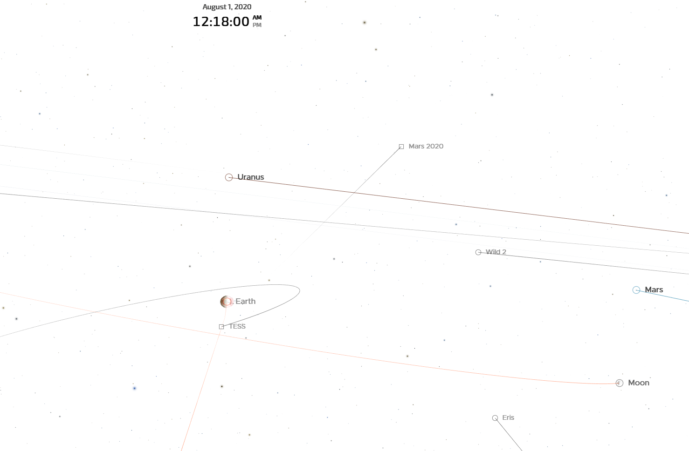

# trajectory

I notice the trajectory of the Mar2020 mission is not in the same
plane as Earth, Mars, and Jupiter. This let me to study more about its
design principle.

What I know about the trajectory calculation is simply based on the
law of gravitation.

Feynman <a href="#feynman2011feynman" title="Feynman, Leighton \&amp; Sands, The Feynman lectures on physics, Vol. I: The new millennium edition: mainly mechanics, radiation, and heat, Basic books (2011).">feynman2011feynman</a> described the law of gravitation as:

> It is that every object in the universe attracts every other object
> with a force which for any two bodies is proportional to the mass of
> each and varies inversely as the square of the distance between them.

Using this law and some experimental observations, one can set up a
set of initial conditions and boundary conditions to solve the
trajectory of the interest.

Todorović's <a href="#todorovic20_arches_chaos_solar_system" title="Nata\vsa Todorovi\'c, Di Wu, Aaron \&amp; Rosengren, The Arches of Chaos in the Solar System, {Science Advances}, v(48), eabd1313 (2020).">todorovic20_arches_chaos_solar_system</a> paper leads
me to learn some basic information about calculating in interplanetary
traveling. This reminds me the event when the Perseverance was
launched to Mars.

The [website](https://eyes.nasa.gov/apps/orrery/#/earth?time=2020-08-01T03:14:31)
gives me an intuition way to think way where the perseverance is. But
I notice the trajectory of perseverance is not in the same plane as
Earth, Mars, Jupiter. What's the principle to design such a
trajectory?

Now, I am learning Lambert's problem, a fascinating problem in
astrodynamics.

# Step to nail it down

## First step is to simulate Earth and Mars

### simulation gravity

# Contributing

Yes, please do! See [CONTRIBUTING][] for guidelines.

# License

See [COPYING][]. Copyright (c) 2020 Ran Wang.

[CONTRIBUTING]: ./CONTRIBUTING.md
[COPYING]: ./COPYING
